<div align="center">

# Graph RAG with LangChain + LangGraph




[](LICENSE)

</div>

A simple, production-shaped **Graph RAG** (Graph Retrieval-Augmented Generation)
system. It builds a knowledge graph from your documents, stores chunk embeddings
for similarity search, and answers questions through a **LangGraph** state
machine that combines **vector search + graph traversal + reranking**.

## Tech stack

| Component        | Choice                                            |
| ---------------- | ------------------------------------------------- |
| ⚡ LLM (answer)   | Groq — `openai/gpt-oss-120b` (langchain-groq)     |
| ⚡ LLM (extraction) | Same Groq model (via `LLMGraphTransformer`)     |
| 🧠 Embeddings    | Cohere — `embed-english-v3.0`                     |
| 🎯 Reranking     | Cohere — `rerank-english-v3.0`                    |
|  Vector DB | Qdrant (cloud) |
|  Graph DB | Neo4j AuraDB (cloud) |
|  Orchestration | LangChain 0.3.x |
|  State machine | LangGraph 0.2.x |
| 🐍 Language      | Python 3.12                                       |
| ⚙️ Config        | `.env` via python-dotenv (nothing hardcoded)      |

## Project structure

```
.
├── .env                  # real keys (gitignored — never commit!)
├── .env.example          # dummy template, safe to commit
├── requirements.txt      # pinned dependencies
├── config.py             # loads all settings from .env (case-insensitive)
├── ingest.py             # CLI: load -> chunk -> Qdrant + Neo4j
├── main.py               # CLI: interactive / single-query Q&A
├── ingestion/
│   ├── document_loader.py  # PDF / TXT / MD / DOCX → Documents
│   ├── chunker.py          # recursive splitting + stable chunk_id
│   ├── vector_store.py     # Cohere embed → Qdrant upsert + search
│   └── graph_builder.py    # LLMGraphTransformer → Neo4j (Entity/Chunk/RELATED)
├── retrieval/
│   ├── vector_retriever.py # Qdrant top-k similarity search
│   ├── graph_retriever.py  # Neo4j 1-2 hop neighbourhood facts
│   └── reranker.py         # Cohere rerank → RAG_TOP_N
├── assets/
│   ├── graph_rag_logo_animated.svg  # animated README logo (SMIL)
│   └── graph_rag_logo.svg           # static logo
└── graph/
    └── workflow.py         # LangGraph state machine (all nodes wired here)
```

## Setup

```bash
# 1) Create & activate the conda environment (already done in `graphai`)
conda create -n graphai python=3.12 -y
conda activate graphai

# 2) Install pinned dependencies
pip install -r requirements.txt

# 3) Create your .env from the template and fill in real keys
cp .env.example .env
#   GROQ_API_KEY, COHERE_API_KEY, QDRANT_URL, QDRANT_API_KEY,
#   NEO4J_URI, NEO4J_USERNAME, NEO4J_PASSWORD
```

> ⚠️ `.env` is never committed. Only `.env.example` (with dummy values) lives in git.

## Usage

### Ingest documents

```bash
python ingest.py ./data                 # folder or single file (.pdf/.txt/.md/.docx)
python ingest.py ./data --recreate      # drop & recreate the Qdrant collection
python ingest.py ./data --skip-graph    # vector-only (Neo4j down? no problem)
python ingest.py ./data --max-chunks 10 # quick smoke test (fewer LLM calls)
```

Ingestion pipeline:
1. **Load** → `document_loader.py`
2. **Chunk** → `RAG_CHUNK_SIZE=500`, `RAG_OVERLAP=80` (each chunk gets a stable `chunk_id`)
3. **Vector** → Cohere embeddings → Qdrant (`chunk_id`, `source`, `text` in payload)
4. **Graph** → `LLMGraphTransformer` extracts entities/relationships, written to Neo4j as:

```
(:Entity {id, type}) -[:RELATED {type}]-> (:Entity {id, type})
(:Entity {id}) -[:MENTIONED_IN]-> (:Chunk {chunk_id, source, text})
```

The `MENTIONED_IN` link cross-references graph entities back to their source
chunks, so citations can resolve to the vector store as well.

### Ask questions

```bash
python main.py                        # interactive loop
python main.py -q "Who founded Tesla?" # one-shot query
```

Retrieval pipeline (LangGraph `graph/workflow.py`):

```
query_input
  -> entity_extraction        (Groq extracts entities from the question)
    -> vector_search          (Qdrant, RAG_TOP_K=20)   \  parallel
    -> graph_search           (Neo4j 1-2 hops)         /
  -> merge_context            (dedupe chunks + graph facts)
  -> rerank                   (Cohere rerank → RAG_TOP_N=5)
  -> generate_answer          (Groq, with [n] citations)
```

## Graceful degradation

Every external call is wrapped so the pipeline **never crashes**:

- **Neo4j down** → `graph_search` returns `[]`; answer is built from vectors only.
- **Qdrant down** → `vector_search` returns `[]`; answer uses graph facts only.
- **Rerank fails** → falls back to original score ordering.
- **No context at all** → the LLM says so instead of guessing.

## Environment variables (.env)

| Variable              | Meaning                          | Default                    |
| --------------------- | -------------------------------- | -------------------------- |
| `GROQ_API_KEY`        | Groq API key                     | — (required)               |
| `GROQ_MODEL`          | Groq model                       | `openai/gpt-oss-120b`       |
| `COHERE_API_KEY`      | Cohere API key                   | — (required)               |
| `COHERE_EMBED_MODEL`  | Embeddings model                 | `embed-english-v3.0`       |
| `COHERE_RERANK_MODEL` | Rerank model                     | `rerank-english-v3.0`      |
| `COHERE_EMBED_DIM`    | Vector dimension (1024)          | `1024`                     |
| `QDRANT_URL`          | Qdrant cloud URL                 | — (required)               |
| `QDRANT_API_KEY`      | Qdrant API key                   | — (required)               |
| `QDRANT_COLLECTION`   | Collection name                  | `graph_rag_chunks`         |
| `NEO4J_URI`           | Neo4j (AuraDB) bolt URL          | — (required)               |
| `NEO4J_USERNAME`      | Neo4j username                   | `neo4j`                    |
| `NEO4J_PASSWORD`      | Neo4j password                   | — (required)               |
| `NEO4J_DATABASE`      | Neo4j database name              | `neo4j`                    |
| `RAG_CHUNK_SIZE`      | Chunk size (chars)               | `500`                      |
| `RAG_OVERLAP`         | Chunk overlap (chars)            | `80`                       |
| `RAG_TOP_K`           | Raw retrievals before rerank     | `20`                       |
| `RAG_TOP_N`           | Final context after rerank       | `5`                        |

Note: `config.py` resolves variable names case-insensitively, so both
`GROQ_API_KEY` and `groq_api_key` work.

## Troubleshooting

- **LLM extraction returns empty graphs** → run with `--max-chunks 5` first,
  watch the Groq call logs; make sure the model supports tool calling.
- **Neo4j connection errors during ingest** → verify `NEO4J_URI`/password and
  that the IP is allowlisted in AuraDB; the script still completes vector-only.
- **`FileNotFoundError ... SSL_CERT_FILE` at startup** → your shell/conda setup has
  a stale `SSL_CERT_FILE`/`SSL_CERT_DIR` pointing to a missing file.
  `config.py` auto-repairs this at import time; to remove the bad value for
  good run `Remove-Item Env:SSL_CERT_FILE`, or unset it in System Properties →
  Environment Variables.
- **"No relevant context found"** → you queried before ingesting, or no vector
  chunk / graph entity matched the question.

## Contributing

Commits in this repository follow the GitHub **co-author trailer** format:

```text
Commit message

Co-authored-by: Cline <cline@noreply.example.com>
```

## Contributors

Built with 🤝 by a human + two AI pair programmers:

<table>
  <tr>
    <td align="center" width="240">
      <a href="https://github.com/ashrafumair111-lab">
        <br />
        <sub><b>@ashrafumair111-lab</b></sub>
      </a><br />
      <sub>👤 Creator &amp; Maintainer</sub>
    </td>
    <td align="center" width="240">
      <a href="https://github.com/cline/cline">
        <br />
        <sub><b>Cline</b> 🤖</sub>
      </a><br />
      <sub>AI Pair Programmer<br />Architecture · Code · Docs</sub>
    </td>
    <td align="center" width="240">
      <a href="https://github.com/anthropics/claude-code">
        <br />
        <sub><b>Claude Code</b> 🤖</sub>
      </a><br />
      <sub>AI Developer<br />Infrastructure · Integration · Automation</sub>
    </td>
  </tr>
</table>

> 💡 This project was built with [Cline](https://github.com/cline/cline) and [Claude Code](https://github.com/anthropics/claude-code) —
> AI coding agents. Commits carry the
> `Co-authored-by: Cline <cline@noreply.example.com>` trailer, the same way
> Claude Code signs the work it helps with.

## License

This project is licensed under the **MIT License** — see the
[LICENSE](LICENSE) file for details.

<a href="LICENSE">
  
</a>

---

<div align="center">
  <sub>Made with ❤️ and  <b>LangChain</b> +  <b>LangGraph</b> +  <b>Neo4j</b> +  <b>Qdrant</b></sub>
</div>